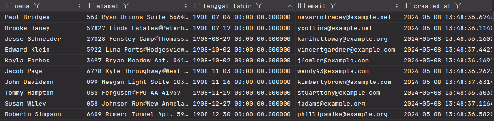

## ETL with Python, Postgres and Docker Compose

Task:
- Create a program to perform ETL from Postgres table to another Postgres table using Python and Postgres Database.
- Student is advised to use Docker Compose in order to achieve this assignment.
- Student might interest to create any kind of data dummy on your Postgres or using any public data (i.e Kaggle, NYC Data).
- Student must ensure the minimum Postgre version is 15 and the Python minimum version used is 3.9.
- It is recommended to use .env file to store sensitive values and volumes to mount necessary data.
- Put the works on GitHub repository and don’t forget to make it public with proper README docs.
- Put what dataset that you're using on the README section

### Penjelasan
Dalam task ini. ETL dilakukan dengan menggunakan tools:
- Python (version 3.12): Digunakan untuk processing ETLnya
- Postgres (version 15): Digunakan untuk menyimpan data
- docker: Digunakan untuk containerizing dan otomatisasi dengan docker compose

### Docker
Docker yang digunakan yaitu docker desktop dan docker compose, terdiri dari: \
`docker-compose.yml` 
```
version: '3'
services:
  postgres-db:
    image: postgres:15
    container_name: postgres_assignment_docker
    env_file:
      - .env
    volumes:
      - pg_data:/var/lib/postgresql/data
    ports:
      - 5437:5432/tcp
    networks:
      - network-docker
  python_docker:d
    build:
      context: .
      dockerfile: Dockerfile
    depends_on:
      - postgres-db
    networks:
      - network-docker

volumes:
  pg_data:
    external: true

networks:
  network-docker:
    external: true
```
Docker compose digunakan untuk membuay service - service yang dibutuhkan \
\
`Dockerfile` \
Docker file digunakan untuk membuat image & configurasi tertentu
```
FROM python:3.12

RUN apt-get update
ENV VIRTUAL_ENV=/usr/local
WORKDIR /etl_docker
RUN curl -LsSf https://astral.sh/uv/install.sh | sh

COPY requirements.txt requirements.txt

RUN /root/.cargo/bin/uv pip install --no-cache-dir -r requirements.txt

COPY etl_script.py etl_script.py

CMD [ "python", "etl_script.py"]
```

### Python
Python digunakan untuk proses etl dan python ini ada didalam docker 
kemudian menggunakan `Dockerfile` untuk membuat image nya \

`etl_script.py`
```
import pandas as pd
from sqlalchemy import create_engine
from faker import Faker
from datetime import datetime
import pytz

user = '<postgres_user_in_docker_service>'
password = '<postgres_password_in_docker_service>'
hostname = '<postgres_hostname_in_docker_service>'
database = '<postgres_db_in_docker_service>'
port = '<postgres_port_in_docker_service>' -- biasanya 5432
conn_string = f'postgresql://{user}:{password}@{hostname}:{port}/{database}'
engine = create_engine(conn_string)
conn = engine.connect()

fake = Faker()
data = []
for _ in range(2000):
    nama = fake.name()
    alamat = fake.address()
    tanggal_lahir = fake.date_of_birth()
    email = fake.email()
    nomor_telepon = fake.phone_number()
    created_at = datetime.now()

    data.append([nama, alamat, tanggal_lahir, email, nomor_telepon, created_at])

df = pd.DataFrame(data, columns=['Nama', 'Alamat', 'Tanggal_Lahir', 'Email', 'Nomor_Telepon', 'created_at'])
df.to_sql("data", engine, if_exists='replace', index=False)


# load to another database table
query = \
"""
    SELECT
        "Nama",
        "Alamat",
        "Tanggal_Lahir",
        "Email",
        "created_at"
    FROM data
 """
df_read = pd.read_sql(query, engine)
df_read = df_read.rename(columns={ # rename columns
                "Nama":"nama",
                "Alamat":"alamat",
                "Tanggal_Lahir":"tanggal_lahir",
                "Email":"email"
            })
# formatting data type
df_read['tanggal_lahir'] = pd.to_datetime(df_read['tanggal_lahir'])
df_read['created_at'] = pd.to_datetime(df_read['created_at'])
df_read.to_sql("data_dummy_2", engine, if_exists='replace', index=False)
```


### Postgres
Postgres disini digunakan untuk menyimpan data

Data yang sudah di load :



\
\
### ***Note:
- file .env:
```
POSTGRES_PASSWORD=<postgres_password>
POSTGRES_USER=<user_password>
POSTGRES_DB=<postgres_db>
```
- run docker
  - masuk ke folder dimaan docker-compose.yml berada
    ```
    docker compose up -d          
    ```
